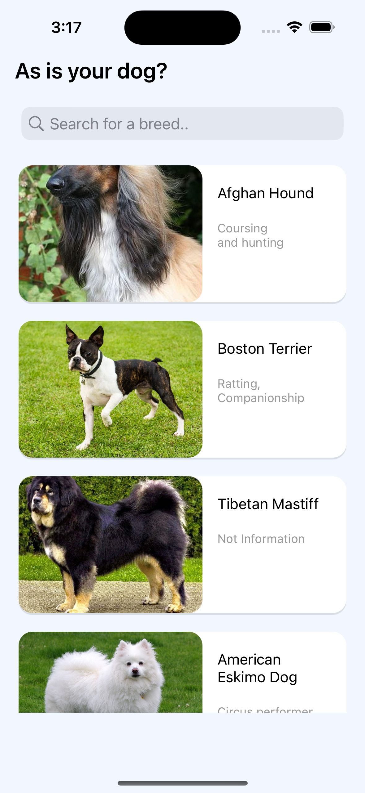
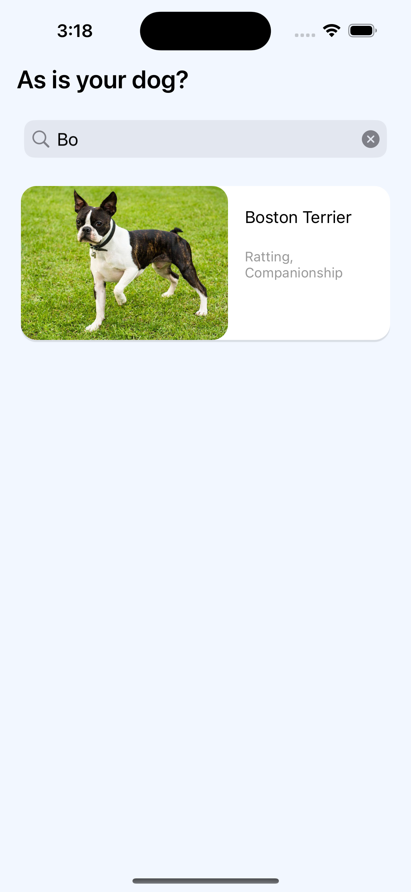
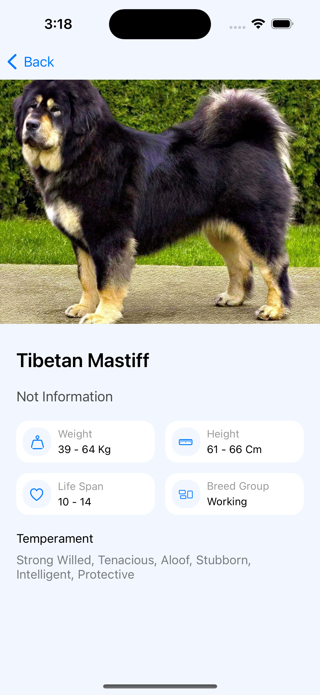
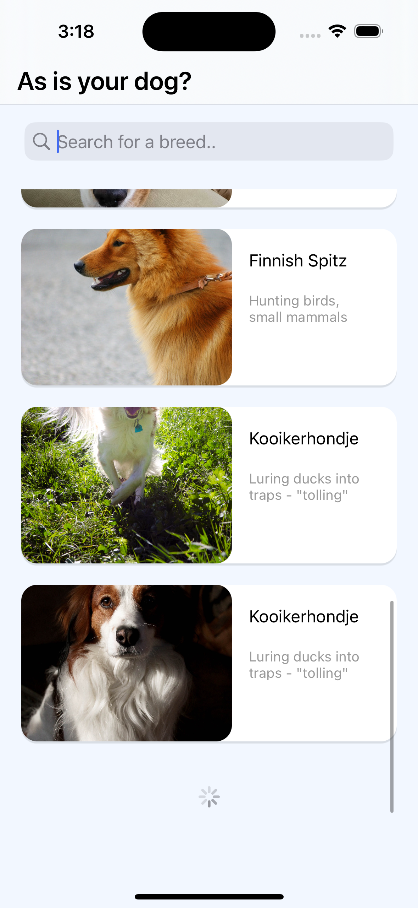

# Search Dogs App

Search Dogs es una aplicación que muestra una lista de perros con una cantidad inicial de 10 y permite cargar más perros a medida que el usuario realiza un scroll. Muestra una animación loading antes de mostrar los siguientes resultados. La aplicación utiliza la arquitectura VIPER (View-Interactor-Entity-Router) para separar la lógica de negocio de la interfaz de usuario. La aplicación tiene como gestor de dependencias a cocoapods, dentro del archivo Pod se declaran las dependencias de Alamofire para realizar la llamada al API y SDWebImage para cargar las imágenes de los perros por su URL.

## Características

- Listado de perros: La pantalla principal muestra una lista inicial de 10 perros, con la opción de cargar más perros a medida que el usuario realiza un scroll hacia el final de la lista. Nota: El final de la lista será actualizado en medida que se carguen más elementos. 
- Buscador por raza: La pantalla principal incluye un campo de búsqueda que permite al usuario buscar perros por cada letra escrita del nombre de su raza. La búsqueda se realiza en tiempo real y se filtra dentro del listado actualmente cargado. Nota: Si hay 10 elementos la cargados, el filtro se aplica para esos 10 elementos cargados. 
- Indicador de carga: A medida que el usuario realiza scroll y llega al final de la lista, se muestra un loading en la parte inferior de la tabla, mostrándose durante 1.5 segundos antes de que aparezcan los demás elementos y luego desaparece cuando los ementos se cargan en la tabla. 
- Pantalla de detalle: Al seleccionar un perro de la lista, la aplicación redirecciona al usuario a una pantalla de detalle dedicada para ese perro. La pantalla de detalle muestra información detallada sobre el perro seleccionado.

## Capturas de pantalla 

## Requisitos

- Xcode 12.0 o superior
- Swift 5.0

## Instalación

1. Clona este repositorio en tu máquina local usando: https://github.com/JimmyDevCode/searchDogsAppIOS.git

2. Abre el archivo `Search Dogs.xcworkspace` en Xcode.

3. Ejecuta la aplicación en el simulador o en un dispositivo físico.

## Dependencias

Este proyecto hace uso de cocoapods para utilizar las siguientes dependencias externas:

- Alamofire: Para realizar la llamada al API y obtener los datos de las razas de perros.
- SDWebImage: Para realizar la carga de la imagen por la URL:

## API Key

Para ejecutar este proyecto, necesitarás generar tu propia API key visitando la página [The Dog API](https://www.thedogapi.com/). Sigue estos pasos para obtener tu API key:

1. Ve a [The Dog API](https://www.thedogapi.com/) en tu navegador web.
2. Desplázate hacia abajo hasta la sección de "Pricing".
3. Elige la versión gratuita y haz clic en "SIGUNP FOR FREE".
4. Completa el formulario con tu correo electrónico. Puedes usar un correo que no sea importante pero que tengas acceso, para evitar el spam.
5. Una vez que completes el registro, recibirás un mensaje con tu API key.
6. Copia tu API key y guárdala en un lugar seguro. La necesitarás para ejecutar la aplicación.

## Añadir API Key al Proyecto

Para añadir tu API key al proyecto, sigue estos pasos:

1. Abre el proyecto Search Dogs.xcworkspace en Xcode.

2. Navega hasta la carpeta Search Dogs, luego a Extras, después a Remote y finalmente a RemoteAPI.

3. Dentro de la clase RemoteAPI, encuentra el método getDataFromAPI. Verás una variable llamada YOUR_API_KEY inicializada en vacío.

4. Reemplaza YOUR_API_KEY con la API key que obtuviste de The Dog API.

## Documentación del API

Puedes consultar la documentación de las distintas formas de llamar al API en [Postman](https://documenter.getpostman.com/view/4016432/the-dog-api/RW81vZ4Z#26bd3f92-dd58-4569-bc13-22fa76396fe8). Esta documentación te proporcionará información detallada sobre los endpoints disponibles y cómo realizar las solicitudes al API.

## Créditos

La aplicación ha sido desarrollada por [Jimmy Macedo](https://github.com/JimmyDevCode).

## Licencia

Este proyecto se encuentra bajo la Licencia MIT. Permite reutilizar el código sin ninguna restricción. Para más detalle revise la información de la licencia. 
